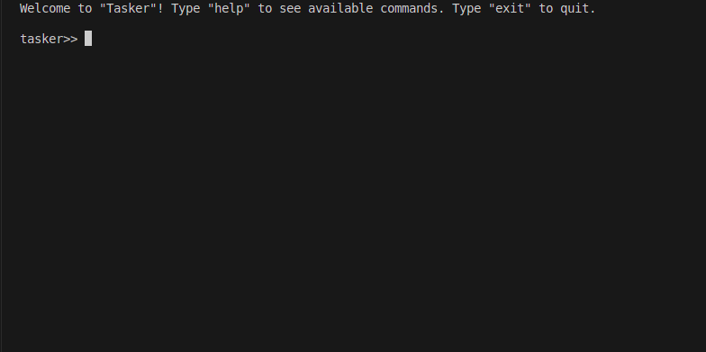
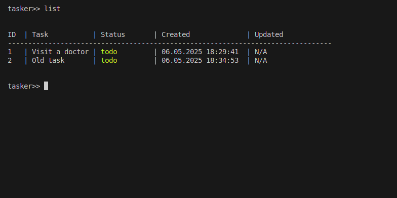
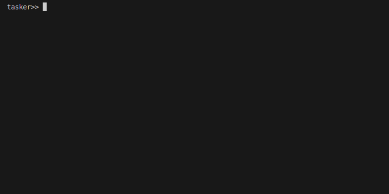
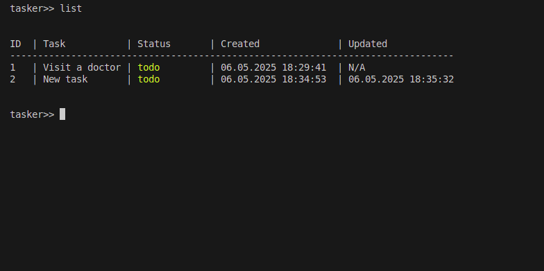
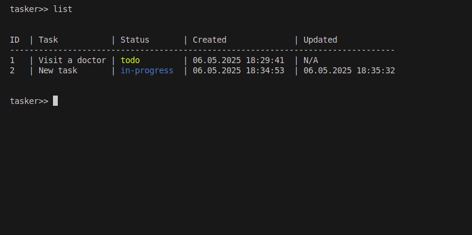

# TASKER: CLI task manager app

## Description
**TASKER** - a simple and convenient Python console program for maintaining trackers of habits, goals or tasks. The program allows you to create, edit, view and delete trackers, as well as track daily marks for each of them.

## Features
- add, update, and delete your tasks
- mark a task as in progress or done
- list all tasks
- list all tasks that are done
- list all tasks that are not done
- list all tasks that are in progress
- see when you created the task and when you updated it

## Installation and Usage

**Installation: can be done via pip**
1. Make sure you have Python 3.6 or later installed.
2. Clone the repository:

<pre>'''bash pip install git+https://github.com/meh-pwn/ToDoTrackerCLI.git'''</pre>

(It is recommended to install in virtual mode)

**Usage: The program works in interactive mode. Just follow the instructions in the console.**

1. Type "tasker" in command line

- add task

- update task

- delete task

- mark task as "in progress"

- mark task as "done"

